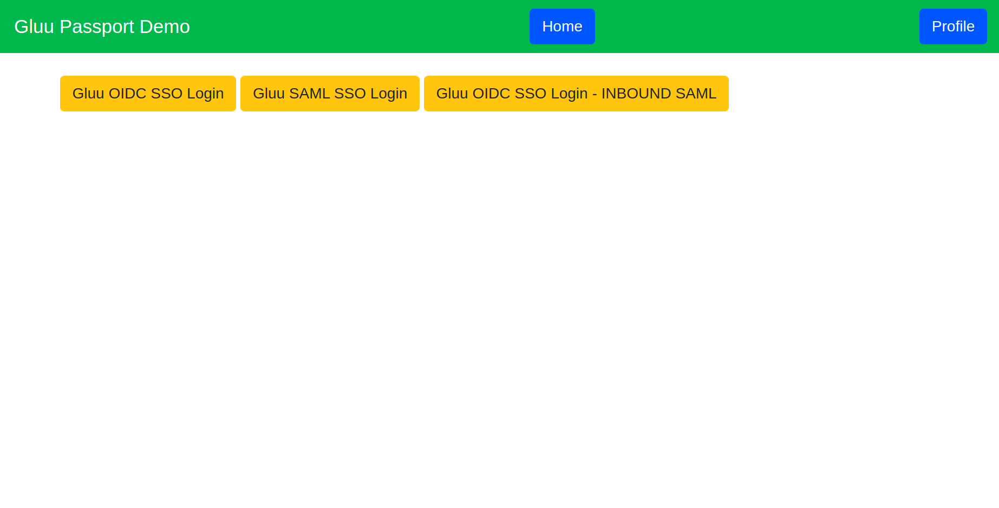

# Nodejs Passport

Nodejs demo application secure by the OpenID Connect and SAML Security. I am using `passport-js` and `Gluu Server` as a OpenID Connect Provider. 
[Check wiki pages](https://github.com/kdhttps/node-passport/wiki) for all the flow details, implementation and integration with Gluu Server.



# Prerequisite

* node js >= 10.x.x
* npm >= 6.x.x
* [Gluu CE](https://gluu.org)


## Installation and Run

 1. Clone the repository and move to cloned directory and hit:

    ```npm install```

    This will install all the dependencies for the project.

 2. To start the project hit:  

    ```
    node index.js
    ```
    or
    ```
    npm start
    ```

## Configuration

[Check wiki pages](https://github.com/kdhttps/node-passport/wiki) for all the flow details, implementation and integration with Gluu Server.

## private_key_jwt flow and implementation

1. First you need to generate jwks for your node passport client. Use below command to generate jwks for client:

   ```
   $ node utils/jwks-generate.js
   ```

   it will console log JWKS keys array. you need to copy and past it in `config/passport-setup.js`.

   This keys use by `openid-client`

2. Tell your OP Server that client want to use `private_key_jwt` token auth method and also give it your JWKS only public key.

   

3. In same OP Client set jwks public key. First step `jwks-generate.js` will give you array with public and private both keys. You only need to share public keys with your OP Server

   For example:
   `jwks-generate.js` returns keys like

```js
{
  keys: [
    {
      e: 'AQAB',
      n: 'y2oEvxA-LUvZfIn5oT0EMoiojTcL9D2dEDEH9w18Kns7QhWGYlsv6RLFlM5BU6ey8WY5sD81kPkwYsp-hxSswsbvydoWOSbUHcI8BQZCNXXbvE2cLv0WYhHK6l6C71P3RzIG8-hvmmIH5E-N8I5xJLJJK1ioWsjz-YcupjJGbUbwnuHjWnOGyjU80qqYmqGgIoizEhbOnwzmKXUiP17ZeEgHEd-qBDAHPlqmfGE8ECfOyvrFoudaHOqsD5g6VvuJN4Fk8jwxfsXtmuF9Wz6JaJCakTTZJDD8dhEy-WxCXvEXQj0682cmP2o_xotfQKcZNyGZr5j3DBsDzMhDQV6Ntw',
      d: 'ODjrauvQY7CtQjDYoGo--MCw5acrVKya9ti2fOBrS0qYTGGqrRDLIz6fAcwoXjjhyrsYgtBVu-ZEK2oQosFiJsvZhw8SSWWkBz2iXTknn6MdwuQooQwu3ZhRX4oT4pZwqGr5ZPz_q8ogqEgc0Tptp1jnxGVS0xTr6jIlAKawtI8C2KJdQ87fBN4SLm9vzVpN33akHvr8A9c069QmZbDExP-Lcsv-X5pyCs-YmNvPfcLxQ9yzikWomX_-2in_MLWu4_UqQg_hlJe8Nl3jaYtPoPTuABRWMNJka1lHVkH137a-eUNTxlZm-rY7jz-d0mEMn-6Hxu48NkDxTXM08POOwQ',
      p: '5ah8D_pRSKy9IU_9xAXqYKjA_kPGD5P2mVo-JuV_elzGPr1QOsND7lowLJWpRuNlRjhidx9ZRe7WGMANUe6r1sgt4ywPANwNz8Unjdk8YHMIePs1_cMplWXOTtuB72l6Qg3ix72eh-rax9Rb-WpqYewubX87GHZGGxm_2SArNpE',
      q: '4r7sgwrwmMtXuo2I0R8S1sFs-ujXTcziyiboQmmg0EkYO608oOvx3k67UQ0gI575cE89KLzNxtuQrxfnfHrlysbHVerHPdtt6I2XbTZU55PPbmzkkPfRFlAWwlFlh_1I9JQ7g1N89inczIYGZdZAzN-qkBYqGW1PnZB1ATwEc8c',
      dp: 'SnKkzRUrVnDQ2sSwkeQNB4qNDZ_wy8n-bdYIQdmxynvatCnwoSv9kH3iEgHuHxHGGc5bdRxPd1EmTF2ts7q4L-cyoOr-bhvnykuyN9SNMwL3YyikZv_mMg0PpRaZd3_s5w7TTkbU5mCmzZK0whTSKa5DmrFc-eAVd-GQBJXeDFE',
      dq: 'gfYCY32St1DdQJy8zXes-ZA14X4xYXNMjadNOjuGo7sxe4rolCeIIu4naOZIBIKq35dbK41DuHXCcMkXsf5S1S2ntPPzLN4nGcKGB1-7vFu46cbaHskbe1l-IfQ7aH1hImYP0k648fK-ji9HXXk2_PY5sYoyqQ5BMsNIfOOkfaM',
      qi: 's5bke08DBep6l4cpVDb-kKY-Q8tzwhwtosWjJdr8sVUlHt2rJ-l1lKDAPLdt2CnyCAYinP_XTs7RD9c1XiZ_FmOM8i9yV-Ug1XYmBNkYwh_kAWC696-Pc3p6Vxtidr1gKgw4rTFxFuLsKag83m8MfmngWqI3kmio2p5gEZZmt5Y',
      kty: 'RSA',
      kid: 'IYPgCuz8-bUx9sZOFo6FF4iN4Eo_S03OjSp2oyrz5zM'
    }
  ]
}

```

   But you need to only share public keys like below:

```js
{
  keys: [
    {
      e: 'AQAB',
      n: 'y2oEvxA-LUvZfIn5oT0EMoiojTcL9D2dEDEH9w18Kns7QhWGYlsv6RLFlM5BU6ey8WY5sD81kPkwYsp-hxSswsbvydoWOSbUHcI8BQZCNXXbvE2cLv0WYhHK6l6C71P3RzIG8-hvmmIH5E-N8I5xJLJJK1ioWsjz-YcupjJGbUbwnuHjWnOGyjU80qqYmqGgIoizEhbOnwzmKXUiP17ZeEgHEd-qBDAHPlqmfGE8ECfOyvrFoudaHOqsD5g6VvuJN4Fk8jwxfsXtmuF9Wz6JaJCakTTZJDD8dhEy-WxCXvEXQj0682cmP2o_xotfQKcZNyGZr5j3DBsDzMhDQV6Ntw',
      kty: 'RSA',
      kid: 'IYPgCuz8-bUx9sZOFo6FF4iN4Eo_S03OjSp2oyrz5zM'
    }
  ]
}

```

   Add above public keys in OP Client

    

4. Now last step, you just need to create issuer, client and register `openid-client` strategy

```js
const { Strategy, Issuer } = require('openid-client')
const { JWKS: { asKeyStore } } = require('jose')
const keySet = {
  keys: [
    {
      e: 'AQAB',
      n: 'y2oEvxA-LUvZfIn5oT0EMoiojTcL9D2dEDEH9w18Kns7QhWGYlsv6RLFlM5BU6ey8WY5sD81kPkwYsp-hxSswsbvydoWOSbUHcI8BQZCNXXbvE2cLv0WYhHK6l6C71P3RzIG8-hvmmIH5E-N8I5xJLJJK1ioWsjz-YcupjJGbUbwnuHjWnOGyjU80qqYmqGgIoizEhbOnwzmKXUiP17ZeEgHEd-qBDAHPlqmfGE8ECfOyvrFoudaHOqsD5g6VvuJN4Fk8jwxfsXtmuF9Wz6JaJCakTTZJDD8dhEy-WxCXvEXQj0682cmP2o_xotfQKcZNyGZr5j3DBsDzMhDQV6Ntw',
      d: 'ODjrauvQY7CtQjDYoGo--MCw5acrVKya9ti2fOBrS0qYTGGqrRDLIz6fAcwoXjjhyrsYgtBVu-ZEK2oQosFiJsvZhw8SSWWkBz2iXTknn6MdwuQooQwu3ZhRX4oT4pZwqGr5ZPz_q8ogqEgc0Tptp1jnxGVS0xTr6jIlAKawtI8C2KJdQ87fBN4SLm9vzVpN33akHvr8A9c069QmZbDExP-Lcsv-X5pyCs-YmNvPfcLxQ9yzikWomX_-2in_MLWu4_UqQg_hlJe8Nl3jaYtPoPTuABRWMNJka1lHVkH137a-eUNTxlZm-rY7jz-d0mEMn-6Hxu48NkDxTXM08POOwQ',
      p: '5ah8D_pRSKy9IU_9xAXqYKjA_kPGD5P2mVo-JuV_elzGPr1QOsND7lowLJWpRuNlRjhidx9ZRe7WGMANUe6r1sgt4ywPANwNz8Unjdk8YHMIePs1_cMplWXOTtuB72l6Qg3ix72eh-rax9Rb-WpqYewubX87GHZGGxm_2SArNpE',
      q: '4r7sgwrwmMtXuo2I0R8S1sFs-ujXTcziyiboQmmg0EkYO608oOvx3k67UQ0gI575cE89KLzNxtuQrxfnfHrlysbHVerHPdtt6I2XbTZU55PPbmzkkPfRFlAWwlFlh_1I9JQ7g1N89inczIYGZdZAzN-qkBYqGW1PnZB1ATwEc8c',
      dp: 'SnKkzRUrVnDQ2sSwkeQNB4qNDZ_wy8n-bdYIQdmxynvatCnwoSv9kH3iEgHuHxHGGc5bdRxPd1EmTF2ts7q4L-cyoOr-bhvnykuyN9SNMwL3YyikZv_mMg0PpRaZd3_s5w7TTkbU5mCmzZK0whTSKa5DmrFc-eAVd-GQBJXeDFE',
      dq: 'gfYCY32St1DdQJy8zXes-ZA14X4xYXNMjadNOjuGo7sxe4rolCeIIu4naOZIBIKq35dbK41DuHXCcMkXsf5S1S2ntPPzLN4nGcKGB1-7vFu46cbaHskbe1l-IfQ7aH1hImYP0k648fK-ji9HXXk2_PY5sYoyqQ5BMsNIfOOkfaM',
      qi: 's5bke08DBep6l4cpVDb-kKY-Q8tzwhwtosWjJdr8sVUlHt2rJ-l1lKDAPLdt2CnyCAYinP_XTs7RD9c1XiZ_FmOM8i9yV-Ug1XYmBNkYwh_kAWC696-Pc3p6Vxtidr1gKgw4rTFxFuLsKag83m8MfmngWqI3kmio2p5gEZZmt5Y',
      kty: 'RSA',
      kid: 'IYPgCuz8-bUx9sZOFo6FF4iN4Eo_S03OjSp2oyrz5zM'
    }
  ]
}

const ks = asKeyStore(keySet)

const issuer = await Issuer.discover(clientCreds.openidClientConfig.issuer)
const Client = new issuer.Client(clientCreds.openidClientConfig, ks.toJWKS(true))
  // openid-client
passport.use('openid-client',
    new Strategy({
      client: Client,
      usePKCE: false
    },
    (token, userinfo, done) => {
      console.log(token, userinfo)
      done(null, { id: userinfo.sub, name: userinfo.name })
    })
)
```